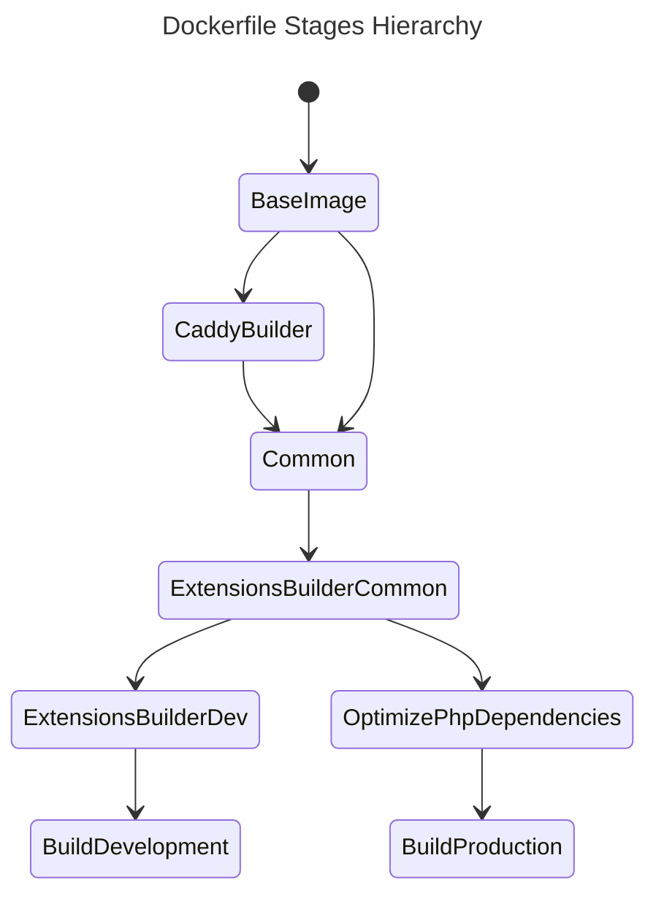
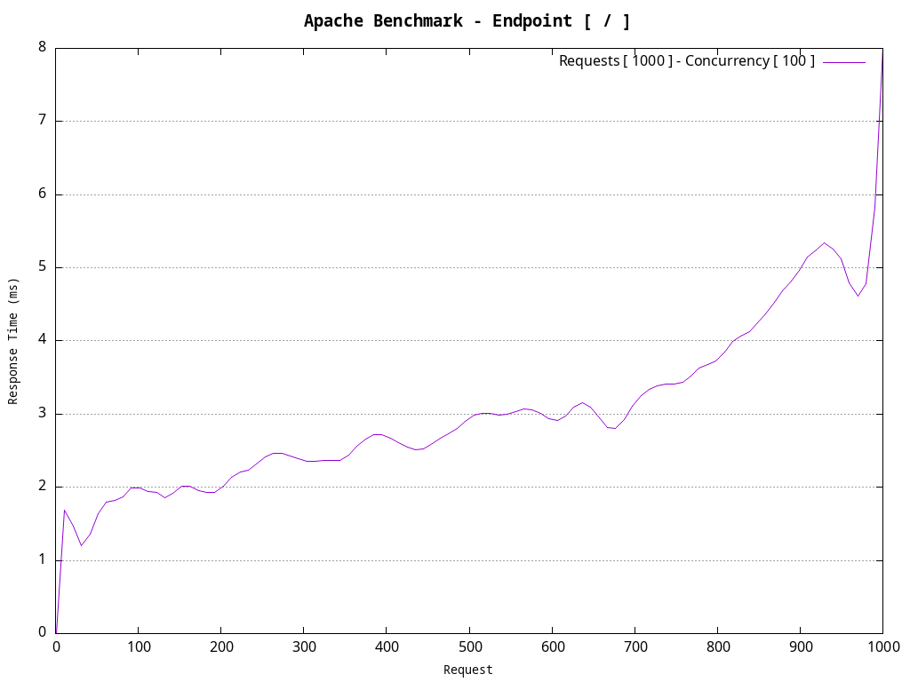
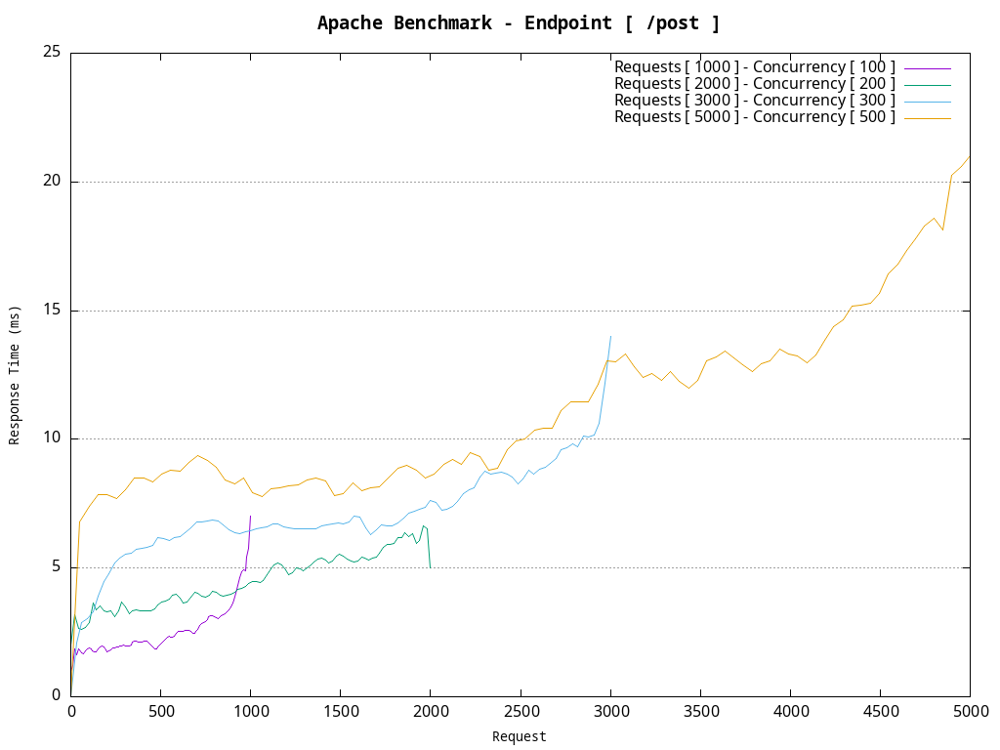
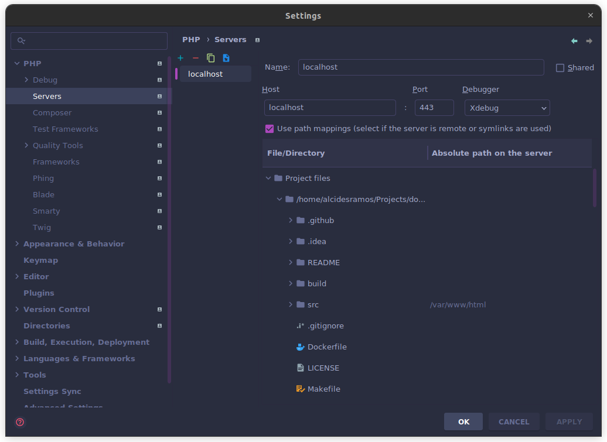

# Dockerized PHP - Caddy

> A _dockerized_ environment with Caddy and PHP-FPM **running on a single container** based on Linux Alpine container. 

[TOC]

------

## Summary

This repository contains a _dockerized_ environment for building PHP applications based on **php:8.5-fpm-alpine** using **caddy:2.11-builder-alpine** and **Apache Benchmark**.

### Highlights

- Unified environment to build <abbr title="Command Line Interface">CLI</abbr>, <u>web applications</u> and/or <u>micro-services</u> based on **PHP8**.
- Multi-stage Dockerfile to allows you to create an optimized **development** or **production-ready** Docker images
- Uses **Caddy webserver**.
- PHP-FPM is **managed internally by Caddy**.
- **Application and web server is in one single container**.
- Includes **Apache Benchmark** for stress testing.

------

## Requirements

To use this repository you need:

- [Docker](https://www.docker.com/) - An open source containerization platform.
- [Git](https://git-scm.com/) - The free and open source distributed version control system.
- [Make](https://www.gnu.org/software/make/) - A command to automate the build/manage process.
- [jq](https://jqlang.github.io/jq/download/) - A lightweight and flexible command-line JSON processor.
- [Gum](https://github.com/charmbracelet/gum) - A tool for glamorous shell scripts.

------

## Built with

| Type           | Component                                                              | Description                                                        |
|----------------|------------------------------------------------------------------------|--------------------------------------------------------------------|
| Infrastructure | [Docker](https://www.docker.com/)                                      | Containerization platform                                          |
| Service        | [Caddy Server](https://caddyserver.com/)                               | Open source web server with automatic HTTPS written in Go          |
| Service        | [Caddy Supervisor](https://github.com/baldinof/caddy-supervisor)       | A module to run and supervise background processes from Caddy      |
| Service        | [PHP-FPM](https://www.php.net/manual/en/install.fpm.php)               | PHP with FastCGI Process Manager                                   |
| Service        | [Apache Benchmark](https://httpd.apache.org/docs/2.4/programs/ab.html) | A tool for benchmarking HTTP servers                               |
| Miscelaneous   | [Bash](https://www.gnu.org/software/bash/)                             | Allows to create an interactive shell within containerized service |
| Miscelaneous   | [Make](https://www.gnu.org/software/make/)                             | Allows to execute commands defined on a _Makefile_                 |
| Miscelaneous   | [jq](https://jqlang.github.io/jq/download/)                            | Allows to beautify the Docker inspections in JSON format           |

------

## Getting Started

Just clone the repository into your preferred path:

```bash
$ mkdir -p ~/path/to/my-new-project && cd ~/path/to/my-new-project
$ git clone git@github.com:AlcidesRC/dockerized-php-caddy.git .
```

### Conventions

#### Dockerfile

`docker/app/Dockerfile` is based on [multi-stage builds](https://docs.docker.com/build/building/multi-stage/) in order to simplify the process to generate the **development container image** and the optimized **production-ready container image**.

##### Defined Stages

| Name                             | Description                                                        |
| -------------------------------- |--------------------------------------------------------------------|
| `base-image`                     | Used to define the base Docker image                               |
| `caddy-builder`                  | Used to build Caddy with a supervisor plugin                       |
| `common`                         | Used to define generic variables: `WORKDIR`, `HEALTCHECK`, etc.    |
| `extensions-builder-required`    | Used to build required PHP extensions                              |
| `extensions-builder-development` | Used to build **development** PHP extensions                       |
| `build-development`              | Used to build the development environment                          |
| `optimize-php-dependencies`      | Used to optimize the PHP dependencies when deployint to production |
| `build-production`               | Used to build the **production** environment                       |

###### Defined Stages Hierarchy



##### Health check

A custom health check script is provided to check the container service by performing the default `PHP-FPM` `ping/pong` check.

You can find this shell script at `build/app/healthcheck.sh`.

> [!NOTE]
>
> Review the `Dockerfile` file and adjust the `HEALTHCHECK` directive options accordingly.

> [!IMPORTANT]
>
> Remember to rebuild the Docker image if you make any change on this file.

##### Non-Privileged User

Current container service uses a **non-privileged user** to execute `PHP-FPM`, with same User/Group ID than the host user.

This mechanism allows to `PHP-FPM` create/update shared resources within the host with the same credentials than current host user, avoiding possible file-permissions issues.

To create this user in the container service, current host user details are collected in the `Makefile` and passed to Docker `build` command as arguments:

| Argument          | Default value   | Required value        | Description                |
| ----------------- | --------------- | --------------------- | -------------------------- |
| `HOST_USER_NAME`  | host-user-name  | `$ id --user --name`  | Current host user name     |
| `HOST_GROUP_NAME` | host-group-name | `$ id --group --name` | Current host group name    |
| `HOST_USER_ID`    | 1000            | `$ id --user`         | Current host user ID       |
| `HOST_GROUP_ID`   | 1000            | `$ id --group`        | Current host user group ID |

> [!NOTE]
>
> Review the `Makefile` and `docker/app/Dockerfile` files and adjust the arguments to your convenience.

> [!IMPORTANT]
>
> Remember to rebuild the Docker image if you make any change on `docker/app/Dockerfile` file.

#### Logging

The container service logs to `STDOUT` by default.

#### Project Structure

```text
.
├── ab-endpoints                               # Apache Benchmark endpoints to be tested
│   ├── homepage                               # Endpoint to be tested
│   │   ├── config                             # Endpoint definitions
│   │   └── runner.sh                          # Apache Benchmark runner script
│   └── post                                   # Endpoint definitions
│       ├── config                             # Endpoint definitions
│       └── runner.sh                          # Apache Benchmark runner script
├── docker
│   ├── ab                                     # Apache Benchmark Docker related stuff
│   │   ├── docker-compose.yml                 # Service Docker Compose file
│   │   └── Dockerfile                         # Service Dockerfile
│   └── app                                    # Application Docker related stuff
│       ├── caddy                              # Caddy related stuff
│       ├── docker-compose.override.dev.yml    # Docker compose file for development environment
│       ├── docker-compose.override.prod.yml   # Docker compose file for production environment
│       ├── docker-compose.yml                 # Service Docker Compose file
│       ├── Dockerfile                         # Service Dockerfile
│       ├── entrypoint.sh                      # Service entrypoint script 
│       ├── healthcheck.sh                     # Service healthcheck script
│       └── php-fpm                            # PHP-FPM related stuff
├── LICENSE
├── Makefile
├── README-CADDY.md
├── README.md
└── src                                        # Application folder
```

##### Volumes

There is a **bind volume** created between the *host* and the container service:

| Host path | Container path  | Description            |
| --------- | --------------- | ---------------------- |
| `./src`   | `/var/www/html` | PHP application folder |

> [!NOTE]
>
> Review the `docker/app/docker-compose.dev.yml` files and adjust the volumes to your convenience.

> [!IMPORTANT]
>
> Remember to rebuild the Docker image if you make any change on `docker/app/Dockerfile` file.

##### Available Commands

A *Makefile* is provided with following commands:

```bash
~/path/to/my-new-project$ make

╔════════════════════════════════════════════════════════════════════════════════╗
║                                                                                ║
║                            .: AVAILABLE COMMANDS :.                            ║
║                                                                                ║
╚════════════════════════════════════════════════════════════════════════════════╝
🔹 HOST USER .....  (1000) alcidesramos 
🔹 HOST GROUP ....  (1000) alcidesramos 
🔹 ENVIRONMENT ...  dev 
🔹 DOMAIN URL ....  https://app.localhost 
🔹 SERVICE(S) ....  caddy 

Choose a command...         
> exit                      
  set-environment           
  build                     
  up                        
  down                      
  restart                   
  logs                      
  inspect                   
  shell                     
  composer-dump             
  composer-install          
  composer-update           
  composer-require          
  composer-require-dev      
  install-caddy-certificate 
                            
  ••                        
←↓↑→ navigate • enter submit
```

#### Web Server

This project uses Caddy as main web server which <u>provides HTTPS by default</u>.

> [!WARNING]
>
> Caddy is optional and you can replace/remove it based on your preferences.

##### Default Domain

The default website domain is https://app.localhost

> [!TIP]
>
> You can customize the domain name in `docker/app/docker-compose.override.xxx.yml`
>
> Review as well the application `.env` to ensure `WEBSITE_URL` constant has the desired domain name for development environment.

> [!IMPORTANT]
>
> Remember to restart the container service(s) if you make any change on any Docker file.

##### Certificate Authority (CA) & SSL Certificate

You can generate/register the **Caddy Authority Certificate** in order to get `SSL` support .

> [!NOTE]
>
> Just execute `make install-caddy-certificate` and follow the provided guidelines to generate the Caddy Authority Certificate and install it on your host.

> [!IMPORTANT]
>
> Remember to reinstall the certificate if you rebuild the container service.

#### PHP Application

PHP application must be placed into `src` folder.

> [!TIP]
>
> There are some `Makefile` commands that allows you to install a [PHP Skeleton](https://github.com/alcidesrc/php-skeleton) as boilerplate, [Laravel](https://github.com/laravel/laravel), [Symfony](https://symfony.com/) or [Lumen](https://lumen.laravel.com/) when creating `PHP` applications from scratch.

### Development

#### Set the environment

This command allows to specify the environment to be working on.

```bash
$ make set-environment
```

```bash
╔════════════════════════════════════════════════════════════════════════════════╗
║                                                                                ║
║                            .: AVAILABLE COMMANDS :.                            ║
║                                                                                ║
╚════════════════════════════════════════════════════════════════════════════════╝
🔹 ENVIRONMENT ... dev                                                         
🔹 DOMAIN URL .... https://app.localhost                                            
🔹 SERVICE(S) .... caddy                                                   
🔹 USER .......... (1000) alcidesramos                                          
🔹 GROUP ......... (1000) alcidesramos                                          

Setting up Makefile environment...
> dev                             
  prod     
```

> [!TIP]
>
> This value is persisted on `.env` file to improve the UX.

#### Building the container

```bash
$ make build
```

#### Starting the container service

```bash
$ make up
```

#### Extracting Caddy Local Authority - 20XX ECC Root

```bash
$ make install-caddy-certificate
```

#### Accessing to web application

```bash
$ make open-website
```

#### Service logs

```bash
$ make logs
```

#### Inspecting services

```bash
$ make inspect
```

#### Stopping the container service

```bash
$ make down
```

### Production

#### Setup the environment

This command allows to specify the environment to be working on.

```bash
$ make set-environment
```

```bash
╔════════════════════════════════════════════════════════════════════════════════╗
║                                                                                ║
║                            .: AVAILABLE COMMANDS :.                            ║
║                                                                                ║
╚════════════════════════════════════════════════════════════════════════════════╝
🔹 ENVIRONMENT ... dev                                                         
🔹 DOMAIN URL .... https://app.localhost                                            
🔹 SERVICE(S) .... caddy                                                   
🔹 USER .......... (1000) alcidesramos                                          
🔹 GROUP ......... (1000) alcidesramos                                          

Setting up Makefile environment...
  dev                             
> prod     
```

> [!TIP]
>
> This value is persisted on `.env` file to improve the UX.

#### Building the container

```bash
$ make build
```

#### Starting the container service

```bash
$ make up
```

#### Extracting Caddy Local Authority - 20XX ECC Root

```bash
$ make install-caddy-certificate
```

#### Accessing to web application

```bash
$ make open-website
```

#### Service logs

```bash
$ make logs
```

#### Inspecting services

```bash
$ make inspect
```

#### Stopping the container service

```bash
$ make down
```

### Stress Tests

This repository includes an independent container with [Apache Benchmark](https://httpd.apache.org/docs/2.4/programs/ab.html) and [GnuPlot](http://www.gnuplot.info/) to perform stress tests against main container service.

> [!IMPORTANT]
>
> With this schema stress tests are totally independent from analyzed services, using ephemeral container services created expressly to perform a test and, once it is finished, the container is destroyed, avoiding possible cache issues. 

#### Metrics

```bash
$ make test-stress
```

##### Defined endpoints

| Endpoint | Method | Payload | Total Requests                  | Concurrent Requests         |
| -------- | ------ | ------- | ------------------------------- | --------------------------- |
| `/`      | `GET`  | N/A     | 1000                            | 100                         |
| `/post`  | `POST` | Yes     | 1000<br/>2000<br/>3000<br/>5000 | 100<br/>200<br/>300<br/>500 |

##### Customizing endpoints

Endpoints are defined in `ab-endpoints` as folders. 

Each folder contains:

```bash
.
├── chart.png              # Generated GNU Plot chart
├── config                 # Endpoint definitions
│   ├── gplot.p            # GNU Plot config file
│   └── payload.json       # Endpoint payload to be sent (if required)
├── gplot.XXXX.data        # Generated Apache Benchmarks metrics
└── runner.sh              # Runner script
```

> [!IMPORTANT]
>
> Pay attention that generated `gplot.XXXX.data` and `chart.png` will be stored in the same folder.

#### Examples

##### Homepage

###### runner.sh

```bash
#!/bin/sh

set -e

ab -k -f ALL -H 'Accept-Encoding: gzip, deflate, br' -H 'Accept: */*' -s 30 -n 1000 -c 100 -g gplot.1000.data http://localhost/

gnuplot ./config/gplot.p
```

###### config/gplot.p

```bash
set terminal png size 1024,768
set size 1,1
set key right top
set grid y

set title "Apache Benchmark - Endpoint [ / ]" font 'Noto Sans Mono:style=Bold,14'
set xlabel "Request" font 'Noto Sans Mono:style=Regular,10'
set ylabel "Response Time (ms)" font 'Noto Sans Mono:style=Regular,10'

set output "chart.png"

## Single metric
plot "gplot.1000.data" using 10 smooth sbezier with lines title "Requests [ 1000 ] - Concurrency [ 100 ]"

exit
```

###### Chart



##### Post

###### runner.sh

```bash
#!/bin/sh

set -e

ab -k -f ALL -H 'Accept-Encoding: gzip, deflate, br' -H 'Accept: */*' -s 30 -p ./config/payload.json -n 1000 -c 100 -g gplot.1000.data http://localhost/post
ab -k -f ALL -H 'Accept-Encoding: gzip, deflate, br' -H 'Accept: */*' -s 30 -p ./config/payload.json -n 2000 -c 200 -g gplot.2000.data http://localhost/post
ab -k -f ALL -H 'Accept-Encoding: gzip, deflate, br' -H 'Accept: */*' -s 30 -p ./config/payload.json -n 3000 -c 300 -g gplot.3000.data http://localhost/post
ab -k -f ALL -H 'Accept-Encoding: gzip, deflate, br' -H 'Accept: */*' -s 30 -p ./config/payload.json -n 5000 -c 500 -g gplot.5000.data http://localhost/post

gnuplot ./config/gplot.p
```

###### config/gplot.p

```bash
set terminal png size 1024,768
set size 1,1
set key right top
set grid y

set title "Apache Benchmark - Endpoint [ /post ]" font 'Noto Sans Mono:style=Bold,14'
set xlabel "Request" font 'Noto Sans Mono:style=Regular,10'
set ylabel "Response Time (ms)" font 'Noto Sans Mono:style=Regular,10'

set output "chart.png"

## Multiple metrics
plot "gplot.1000.data" using 10 smooth sbezier with lines title "Requests [ 1000 ] - Concurrency [ 100 ]", \
     "gplot.2000.data" using 10 smooth sbezier with lines title "Requests [ 2000 ] - Concurrency [ 200 ]", \
     "gplot.3000.data" using 10 smooth sbezier with lines title "Requests [ 3000 ] - Concurrency [ 300 ]", \
     "gplot.5000.data" using 10 smooth sbezier with lines title "Requests [ 5000 ] - Concurrency [ 500 ]"

exit
```

###### config/payload.json

```json
{
  "param1": "1",
  "param2": "2"
}
```

###### Chart



### Debug / Setup PHPStorm

#### Docker-Compose Environment

Please update the `docker-compose.override.dev.yml` file with proper `PHP_XDEBUG_CLIENT_HOST` IP address. You can get this value just by executing the following command:

```bash
$ make get-xdebug-client-host
```

So the `docker-compose.override.dev.yml` should look like:

```yaml
environment:
    - PHP_XDEBUG_IDEKEY=PHPSTORM
    - PHP_XDEBUG_MODE=develop,coverage,debug,profile
    - PHP_XDEBUG_START_WITH_REQUEST=yes
    - PHP_XDEBUG_CLIENT_HOST=172.18.0.1
    - PHP_XDEBUG_CLIENT_PORT=9003
    - PHP_XDEBUG_MAX_NESTING_LEVEL=3000
    - PHP_XDEBUG_OUTPUT_DIR=/tmp/xdebug
    - PHP_XDEBUG_DISCOVER_CLIENT_HOST=false
    - PHP_XDEBUG_LOG=/dev/stdout
    - PHP_XDEBUG_LOG_LEVEL=0
...
```

#### Help > Change Memory Settings

To allow PHPStorm index huge projects consider to increase the default assigned memory amount from 2048 MiB up to 8192 MiB.


#### Settings > PHP > Debug

Ensure the `Max. simultaneous connections` is set to 1 to avoid trace collisions when debugging.


#### Settings > PHP > Servers

Ensure the `~/path/to/my-new-project/src` folder is mapped to `/var/www/html`



#### Settings > PHP


> [!IMPORTANT]
>
> When selecting Docker Compose configuration files, ensure to include:
>
> 1. The `docker/app/docker-compose.yml` file, which contains the default service(s) specification
> 2. The `docker/app/docker-compose.override.dev.yml` file, which may contains some override values or customization from default specification.
>
> **The order on here is important!**


------

## Security Vulnerabilities

Please review our security policy on how to report security vulnerabilities:

**PLEASE DON'T DISCLOSE SECURITY-RELATED ISSUES PUBLICLY**

### Supported Versions

Only the latest major version receives security fixes.

### Reporting a Vulnerability

If you discover a security vulnerability within this project, please [open an issue here](https://github.com/alcidesrc/dockerized-php-caddy/issues). All security vulnerabilities will be promptly addressed.

------

## License

The MIT License (MIT). Please see [LICENSE](./LICENSE) file for more information.
